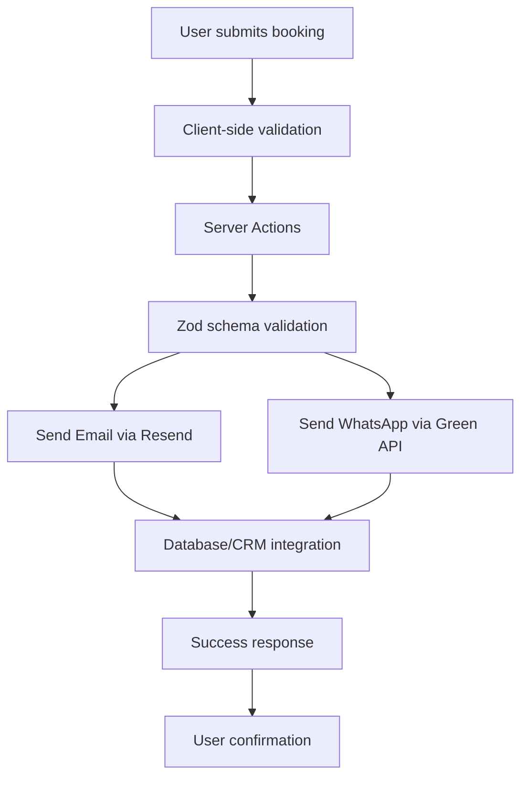

# Vic Cabs - Premium Melbourne Taxi & Chauffeur Service


A modern, responsive Next.js web application for Vic Cabs, Melbourne's premier taxi and chauffeur service. Features online booking, real-time notifications, and comprehensive service information.

## 🚀 Live Demo

- **Production URL**: [https://viccabs.com.au](https://viccabs.com.au)
- **Staging**: (Configure as needed)

## 📋 Table of Contents

- [Features](#features)
- [Technology Stack](#technology-stack)
- [Project Structure](#project-structure)
- [Getting Started](#getting-started)
- [Environment Variables](#environment-variables)
- [Development Workflow](#development-workflow)
- [Architecture](#architecture)
- [API Integrations](#api-integrations)
- [Deployment](#deployment)
- [Contributing](#contributing)
- [License](#license)

## ✨ Features

### Core Functionality
- **Online Booking System**: Comprehensive booking form with real-time validation
- **Dual Notification System**: Email + WhatsApp notifications for new bookings
- **Address Autocomplete**: Mapbox-powered address search with Australian bias
- **Responsive Design**: Mobile-first approach with Tailwind CSS
- **SEO Optimized**: Comprehensive metadata and structured data for local SEO

### Business Features
- **Service Types**: Sedan, SUV (5/7 seater), Taxi Van, Wheelchair Van, Parcel Delivery
- **24/7 Availability**: Round-the-clock booking and customer support
- **Service Area**: Melbourne CBD and all surrounding suburbs
- **Multiple Contact Methods**: Phone, online booking, and contact form

### Technical Features
- **Type Safety**: Full TypeScript implementation
- **Form Validation**: Zod schema validation with React Hook Form
- **Server Actions**: Secure server-side form processing
- **Performance**: Image optimization, code splitting, and caching
- **Analytics**: Google Analytics integration

## 🛠 Technology Stack

### Frontend
- **Next.js 14** - React framework with App Router
- **TypeScript** - Type-safe JavaScript
- **Tailwind CSS** - Utility-first CSS framework
- **React Hook Form** - Form state management
- **Zod** - Schema validation
- **Radix UI** - Accessible UI components
- **Lucide React** - Icon library

### Backend & APIs
- **Next.js Server Actions** - Server-side form processing
- **Resend** - Transactional email service
- **Green API** - WhatsApp Business API
- **Mapbox** - Address search and geocoding
- **Axios** - HTTP client for API calls

### Development Tools
- **ESLint** - Code linting
- **PostCSS** - CSS processing
- **Commitizen** - Conventional commits
- **Husky** - Git hooks

## 📁 Project Structure

```
viccabs/
├── app/                          # Next.js App Router
│   ├── layout.tsx               # Root layout with metadata
│   ├── page.tsx                 # Homepage
│   ├── pages/                   # Additional pages
│   │   ├── about/               # About page
│   │   ├── book/                # Booking page
│   │   ├── contact/             # Contact page
│   │   ├── services/            # Services page
│   │   └── whyChoose/           # Why Choose Us page
│   ├── sitemap.tsx              # Dynamic sitemap
│   └── robots.tsx               # Robots.txt configuration
├── components/                   # React components
│   ├── BookingForm.tsx          # Main booking form
│   ├── form/                    # Form field components
│   │   ├── AddressAutocomplete.tsx  # Mapbox address input
│   │   ├── AddressFields.tsx    # Address form fields
│   │   ├── DateTimeFields.tsx   # Date/time pickers
│   │   ├── PersonalInfoFields.tsx   # Personal info fields
│   │   └── types.ts             # Form type definitions
│   ├── ui/                      # Reusable UI components
│   │   ├── button.tsx           # Button component
│   │   ├── calendar.tsx         # Date picker
│   │   ├── input.tsx            # Input field
│   │   ├── label.tsx            # Form label
│   │   ├── popover.tsx          # Popover component
│   │   ├── select.tsx           # Select dropdown
│   │   ├── textarea.tsx         # Text area
│   │   └── time-picker.tsx      # Time picker
│   ├── NavMenu.tsx              # Navigation menu
│   └── Footer.tsx               # Site footer
├── lib/                         # Utility functions
│   ├── _actions.ts              # Server actions
│   └── utils.ts                 # Utility functions
├── models/                      # Data models
│   └── Booking.ts               # Booking schema and types
├── email/                       # Email templates
│   └── BookingEmail.tsx         # Booking confirmation email
├── public/                      # Static assets
│   ├── images/                  # Website images
│   └── favicon.ico              # Site favicon
└── config/                      # Configuration files
    ├── next.config.js           # Next.js configuration
    ├── tailwind.config.ts       # Tailwind configuration
    └── package.json             # Dependencies
```

## 🚀 Getting Started

### Prerequisites

- Node.js 18+ and npm/yarn/pnpm/bun
- Mapbox API key (for address autocomplete)
- Resend API key (for email notifications)
- Green API credentials (for WhatsApp notifications)

### Installation

1. **Clone the repository**
   ```bash
   git clone https://github.com/your-username/viccabs.git
   cd viccabs
   ```

2. **Install dependencies**
   ```bash
   npm install
   # or
   yarn install
   # or
   pnpm install
   # or
   bun install
   ```

3. **Set up environment variables**
   ```bash
   cp .env.example .env.local
   # Edit .env.local with your API keys
   ```

4. **Run the development server**
   ```bash
   npm run dev
   # or
   yarn dev
   # or
   pnpm dev
   # or
   bun dev
   ```

5. **Open your browser**
   Navigate to [http://localhost:3000](http://localhost:3000)

## 🔧 Environment Variables

Create a `.env.local` file in the root directory with the following variables:

### Required Variables
```env
# Mapbox API (Address Autocomplete)
NEXT_PUBLIC_MAPBOX_ACCESS_TOKEN=your_mapbox_access_token
NEXT_PUBLIC_MAPBOX_SESSION_TOKEN=your_mapbox_session_token

# Resend API (Email Notifications)
RESEND_API_KEY=your_resend_api_key

# Green API (WhatsApp Notifications)
GREEN_API_BASE_URL=https://api.green-api.com
GREEN_API_ID_INSTANCE=your_instance_id
GREEN_API_TOKEN_INSTANCE=your_instance_token

# WhatsApp Recipients (comma-separated)
WHATSAPP_RECIPIENTS=+614xxxxxxxx,+614xxxxxxxx
```

### Optional Variables
```env
# Google Analytics
NEXT_PUBLIC_GA_MEASUREMENT_ID=G-XXXXXXXXXX

# Application URLs
NEXT_PUBLIC_SITE_URL=https://viccabs.com.au
NEXT_PUBLIC_SITE_NAME=Vic Cabs
```

## 🏗 Development Workflow

### Available Scripts

```bash
# Development server
npm run dev

# Production build
npm run build

# Start production server
npm start

# Lint code
npm run lint

# Format code with Prettier
npm run format

# Commit with conventional commits
npm run commit
```

### Code Quality

- **TypeScript**: Strict type checking enabled
- **ESLint**: Airbnb configuration with React hooks rules
- **Prettier**: Consistent code formatting
- **Husky**: Pre-commit hooks for linting

### Git Workflow

1. Create a feature branch: `git checkout -b feature/description`
2. Make changes and commit: `npm run commit`
3. Push to remote: `git push origin feature/description`
4. Create pull request for review

## 🏛 Architecture

### Data Flow



### Component Architecture

- **App Router**: File-based routing with layout hierarchy
- **Server Components**: Default for better performance
- **Client Components**: Only where interactivity is needed (`'use client'`)
- **Modular Components**: Reusable, single-responsibility components
- **Type Safety**: Full TypeScript coverage with strict mode

### State Management

- **React Hook Form**: Form state and validation
- **React State**: Local component state
- **URL State**: Routing and query parameters
- **Server State**: Data fetching and mutations via Server Actions

## 🔌 API Integrations

### Mapbox Search Box API
- **Purpose**: Address autocomplete and geocoding
- **Endpoints**: `/suggest` for suggestions, `/retrieve` for details
- **Configuration**: Australian bias, address/POI/place types
- **Rate Limits**: 100 requests/second (free tier)

### Resend API
- **Purpose**: Transactional email notifications
- **Templates**: React email components with plain text fallback
- **Recipients**: Multiple admin emails with reply-to customer
- **Features**: Open tracking, click tracking, analytics

### Green API (WhatsApp)
- **Purpose**: Instant booking notifications
- **Format**: Structured messages with emojis and sections
- **Recipients**: Multiple business phone numbers
- **Fallback**: Graceful degradation if API fails

### Google Analytics
- **Implementation**: Script component with afterInteractive strategy
- **Events**: Page views, form submissions, conversions
- **Privacy**: GDPR-compliant configuration

## 🚢 Deployment

### Vercel (Recommended)

1. **Connect repository** to Vercel
2. **Configure environment variables** in Vercel dashboard
3. **Deploy automatically** on push to main branch
4. **Preview deployments** for pull requests

```bash
# Manual deployment with Vercel CLI
npm i -g vercel
vercel
vercel --prod
```

### Build Optimization

- **Image Optimization**: Automatic WebP/AVIF conversion
- **Code Splitting**: Automatic route-based splitting
- **Caching**: CDN caching for static assets
- **Compression**: Gzip/Brotli compression enabled

### Monitoring

- **Vercel Analytics**: Performance and usage metrics
- **Google Analytics**: User behavior and conversions
- **Error Tracking**: (Consider adding Sentry or similar)

## 🤝 Contributing

1. **Fork the repository**
2. **Create a feature branch**: `git checkout -b feature/amazing-feature`
3. **Commit your changes**: `npm run commit`
4. **Push to the branch**: `git push origin feature/amazing-feature`
5. **Open a Pull Request**

### Development Guidelines

- Follow TypeScript strict mode
- Write comprehensive JSDoc comments
- Add tests for new functionality
- Update documentation as needed
- Use conventional commit messages

## 📄 License

This project is proprietary and confidential. All rights reserved.

## 📞 Support

For technical issues:
- Create an issue in the repository
- Email: tech@viccabs.com.au

For business inquiries:
- Phone: 0477 226 627
- Email: admin@viccabs.com.au
- Website: https://viccabs.com.au

---

**Built with ❤️ for Melbourne by Vic Cabs**